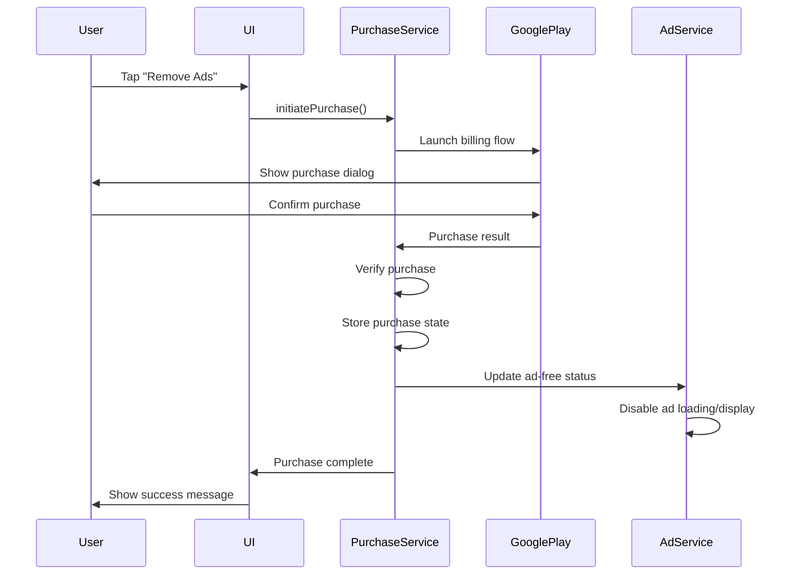

# Design Document: Remove Ads Purchase

## Overview

This design document outlines the implementation of a one-time in-app purchase feature that allows users to permanently remove ads from the music player application. The solution integrates with Google Play Billing using Flutter's `in_app_purchase` plugin to provide a seamless purchase experience with persistent ad-free functionality.

The design follows a service-oriented architecture where a new `PurchaseService` handles all purchase operations and integrates with the existing `AdService` to control ad display behavior based on purchase status.

## Architecture

The remove ads purchase feature consists of three main architectural components:

### Core Services
- **PurchaseService**: Manages all in-app purchase operations, product configuration, and purchase state
- **AdService Integration**: Enhanced existing service to check purchase status before ad operations
- **Storage Layer**: Secure local storage for purchase state and tokens

### Purchase Flow


### State Management
The purchase state flows through the application using a reactive pattern:
- PurchaseService maintains the authoritative purchase state
- AdService subscribes to purchase state changes
- UI components reflect current purchase status
- State persists across app sessions through secure storage

## Components and Interfaces

### PurchaseService Interface

```dart
abstract class PurchaseService {
  // Core purchase operations
  Future<void> initialize();
  Future<bool> isAvailable();
  Future<List<ProductDetails>> getProducts();
  Future<void> initiatePurchase(String productId);
  Future<void> restorePurchases();
  
  // Purchase state management
  bool get hasRemovedAds;
  Stream<bool> get purchaseStateStream;
  
  // Configuration and testing
  void setTestMode(bool enabled);
  Future<void> resetPurchaseState(); // For testing only
  
  // Cleanup
  Future<void> dispose();
}
```

### PurchaseServiceImpl Implementation

```dart
class PurchaseServiceImpl implements PurchaseService {
  static const String _removeAdsProductId = 'remove_ads_forever';
  static const String _testProductId = 'android.test.purchased';
  
  final InAppPurchase _inAppPurchase;
  final SharedPreferences _prefs;
  final StreamController<bool> _purchaseStateController;
  
  bool _hasRemovedAds = false;
  bool _isTestMode = false;
  StreamSubscription<List<PurchaseDetails>>? _purchaseSubscription;
  
  // Implementation details...
}
```

### AdService Integration

The existing AdService will be enhanced with purchase status checking:

```dart
class AdService {
  final PurchaseService _purchaseService;
  StreamSubscription<bool>? _purchaseSubscription;
  
  Future<void> initialize() async {
    // Subscribe to purchase state changes
    _purchaseSubscription = _purchaseService.purchaseStateStream.listen(
      (hasRemovedAds) {
        if (hasRemovedAds) {
          _disposeCurrentAd();
          _stopAdLoading();
        } else {
          _resumeAdLoading();
        }
      },
    );
    
    // Only initialize ads if user hasn't purchased removal
    if (!_purchaseService.hasRemovedAds) {
      await _initializeAds();
    }
  }
  
  Future<void> showInterstitialAd() async {
    // Check purchase status before showing ads
    if (_purchaseService.hasRemovedAds) {
      debugPrint('Ads removed - skipping ad display');
      return;
    }
    
    // Existing ad display logic...
  }
}
```

### UI Components

#### Remove Ads Button Widget
```dart
class RemoveAdsButton extends StatelessWidget {
  final PurchaseService purchaseService;
  
  Widget build(BuildContext context) {
    return StreamBuilder<bool>(
      stream: purchaseService.purchaseStateStream,
      builder: (context, snapshot) {
        final hasRemovedAds = snapshot.data ?? false;
        
        if (hasRemovedAds) {
          return _buildAdsRemovedStatus();
        } else {
          return _buildPurchaseButton();
        }
      },
    );
  }
}
```

## Data Models

### Purchase Configuration
```dart
class PurchaseConfig {
  static const String removeAdsProductId = 'remove_ads_forever';
  static const String testProductId = 'android.test.purchased';
  static const double suggestedPrice = 2.99; // USD
  
  // Test product IDs for development
  static const Map<String, String> testProductIds = {
    'android': 'android.test.purchased',
    'ios': 'com.example.test.purchase',
  };
}
```

### Purchase State Model
```dart
class PurchaseState {
  final bool hasRemovedAds;
  final String? purchaseToken;
  final DateTime? purchaseDate;
  final bool isVerified;
  
  const PurchaseState({
    required this.hasRemovedAds,
    this.purchaseToken,
    this.purchaseDate,
    this.isVerified = false,
  });
  
  Map<String, dynamic> toJson() => {
    'hasRemovedAds': hasRemovedAds,
    'purchaseToken': purchaseToken,
    'purchaseDate': purchaseDate?.toIso8601String(),
    'isVerified': isVerified,
  };
  
  factory PurchaseState.fromJson(Map<String, dynamic> json) => PurchaseState(
    hasRemovedAds: json['hasRemovedAds'] ?? false,
    purchaseToken: json['purchaseToken'],
    purchaseDate: json['purchaseDate'] != null 
        ? DateTime.parse(json['purchaseDate']) 
        : null,
    isVerified: json['isVerified'] ?? false,
  );
}
```

Now I need to use the prework tool to analyze the acceptance criteria before writing the correctness properties.

<function_calls>
<invoke name="prework">
<parameter name="featureName">remove-ads-purchase

## Correctness Properties

*A property is a characteristic or behavior that should hold true across all valid executions of a system—essentially, a formal statement about what the system should do. Properties serve as the bridge between human-readable specifications and machine-verifiable correctness guarantees.*

Based on the prework analysis, I've identified several properties that can be validated through property-based testing. After reviewing for redundancy, the following properties provide comprehensive coverage without overlap:

### Property 1: Test Mode Configuration Consistency
*For any* Purchase_Service instance, when test mode is enabled, the service should use test product IDs consistently across all operations
**Validates: Requirements 1.3**

### Property 2: Configuration Validation and Fallback
*For any* invalid product configuration, the Purchase_Service should log appropriate errors and fall back to test configuration
**Validates: Requirements 1.4, 1.5**

### Property 3: Purchase Verification and State Update
*For any* successful purchase completion, the Purchase_Service should verify the purchase with Google Play and update the ad-free status accordingly
**Validates: Requirements 2.2, 2.3**

### Property 4: Purchase Error Handling
*For any* failed purchase attempt, the Purchase_Service should provide clear error messaging and maintain current state
**Validates: Requirements 2.4**

### Property 5: Purchase State Persistence
*For any* completed purchase, the purchase state should be persisted locally and retrievable across app sessions
**Validates: Requirements 2.5**

### Property 6: Purchase State Restoration
*For any* valid existing purchase found during startup, the Purchase_Service should restore the ad-free state correctly
**Validates: Requirements 3.2**

### Property 7: Invalid Token Handling
*For any* invalid purchase token, the Purchase_Service should revert to ad-supported mode
**Validates: Requirements 3.4**

### Property 8: Ad Service Integration - Display Prevention
*For any* user with ad removal purchased, the Ad_Service should not display or load any interstitial ads
**Validates: Requirements 4.1, 4.2**

### Property 9: Ad Service Purchase Status Checking
*For any* ad operation, the Ad_Service should check purchase status before proceeding with ad-related activities
**Validates: Requirements 4.3**

### Property 10: Reactive Ad Behavior Updates
*For any* purchase status change, the Ad_Service should immediately update ad behavior and dispose of loaded ads when ad removal is activated
**Validates: Requirements 4.4, 4.5**

### Property 11: UI Purchase Status Reflection
*For any* user with purchased ad removal, the UI should display "Ads Removed" status instead of purchase options
**Validates: Requirements 5.3**

### Property 12: Purchase Progress UI Feedback
*For any* purchase in progress, the UI should display appropriate loading indicators
**Validates: Requirements 5.5**

### Property 13: Service Unavailability Handling
*For any* scenario where Google Play services are unavailable, the Purchase_Service should inform the user and provide retry options
**Validates: Requirements 6.1**

### Property 14: Network Error Resilience
*For any* network connectivity issues, the Purchase_Service should handle timeouts gracefully without crashing
**Validates: Requirements 6.2**

### Property 15: Interrupted Purchase Recovery
*For any* interrupted purchase, the Purchase_Service should check for pending purchases on the next app launch
**Validates: Requirements 6.3**

### Property 16: Purchase Verification Retry Logic
*For any* failed purchase verification, the Purchase_Service should retry verification up to 3 times before giving up
**Validates: Requirements 6.4**

### Property 17: Verification Failure Fallback
*For any* purchase where all verification attempts fail, the Purchase_Service should log the issue and maintain the current ad state
**Validates: Requirements 6.5**

### Property 18: Server-Side Purchase Validation
*For any* purchase, the Purchase_Service should validate it with Google Play servers rather than relying solely on local data
**Validates: Requirements 7.1, 7.5**

### Property 19: Secure Purchase Data Storage
*For any* purchase token and state data, the Purchase_Service should store it using secure storage mechanisms
**Validates: Requirements 7.2**

### Property 20: Purchase Signature Verification
*For any* purchase, the Purchase_Service should implement and verify purchase signatures for security
**Validates: Requirements 7.3**

### Property 21: Security Validation Fallback
*For any* purchase that fails security validation, the Purchase_Service should revert to ad-supported mode
**Validates: Requirements 7.4**

### Property 22: Development Mode Test Configuration
*For any* Purchase_Service in development mode, it should use test product IDs consistently
**Validates: Requirements 8.2**

### Property 23: Debug Logging Coverage
*For any* purchase operation, the Purchase_Service should provide appropriate debug logging when debug mode is enabled
**Validates: Requirements 8.3, 8.5**

## Error Handling

The purchase system implements comprehensive error handling across multiple layers:

### Purchase Flow Errors
- **Billing unavailable**: Graceful degradation with user notification and retry options
- **Product not found**: Fallback to test products with appropriate logging
- **Purchase cancelled**: Clean state management without side effects
- **Purchase failed**: Clear error messaging with retry capabilities
- **Network timeouts**: Automatic retry with exponential backoff

### Verification Errors
- **Server validation failure**: Up to 3 retry attempts with logging
- **Invalid signatures**: Immediate reversion to ad-supported mode
- **Token validation failure**: Secure fallback with state cleanup

### Integration Errors
- **AdService communication**: Graceful handling of service unavailability
- **Storage errors**: Fallback to in-memory state with user notification
- **UI state errors**: Defensive programming with default states

### Security Considerations
- All purchase tokens stored in secure storage (Keychain/Keystore)
- Purchase signatures verified before state updates
- Server-side validation required for all purchases
- No reliance on client-side only validation
- Secure cleanup of sensitive data on errors

## Testing Strategy

The testing strategy employs a dual approach combining unit tests for specific scenarios and property-based tests for comprehensive validation:

### Unit Testing Focus
- **Specific purchase scenarios**: Test concrete purchase flows with known inputs
- **Error condition examples**: Test specific error cases (network failure, invalid tokens)
- **UI integration points**: Test button interactions and state display
- **Edge cases**: Test app reinstall scenarios, interrupted purchases

### Property-Based Testing Focus
- **Universal purchase behaviors**: Validate properties across all possible purchase states
- **Configuration variations**: Test all combinations of test/production modes
- **Error resilience**: Generate various error conditions to test system robustness
- **State consistency**: Verify purchase state remains consistent across operations
- **Security properties**: Test that security validations work across all inputs

### Testing Configuration
- **Minimum 100 iterations** per property test to ensure comprehensive coverage
- **Test product IDs** used during development to avoid billing issues
- **Mock Google Play responses** for isolated testing
- **Integration tests** with real Google Play Billing in staging environment

### Property Test Implementation
Each property test will be implemented using the `test` package with custom generators:
- **Purchase state generators**: Create various purchase states and configurations
- **Error condition generators**: Simulate network failures, invalid responses
- **Time-based generators**: Test purchase restoration and expiration scenarios
- **Configuration generators**: Test various product ID and pricing configurations

Property tests will be tagged with the format: **Feature: remove-ads-purchase, Property {number}: {property_text}** to maintain traceability to design requirements.