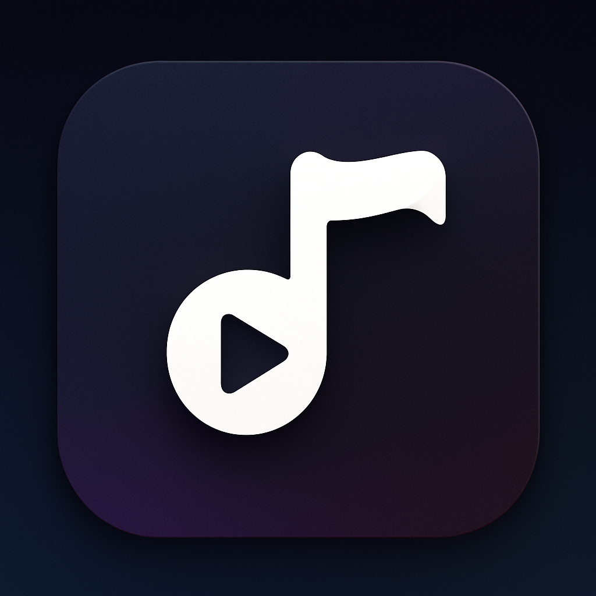

# Music Player App 🎵

A modern, feature-rich Flutter music player app for Android with a stunning 3D UI design and comprehensive playback controls.



## ✨ Features

### 🎨 Modern 3D UI Design
- **Dark Theme**: Sophisticated gradient design matching the app icon
- **3D Effects**: Multi-layered shadows, borders, and depth effects
- **Smooth Animations**: Fluid transitions between screens
- **Custom Gradients**: Navy blue to purple gradient throughout

### 🎵 Music Playback
- **Background Playback**: Continue listening while using other apps
- **Media Notifications**: Full control from notification panel
- **Queue Management**: Add, remove, and reorder songs
- **Shuffle Mode**: Randomize playback order
- **Repeat Modes**: Off, Repeat All, Repeat One
- **Play Next**: Add songs to play immediately after current track
- **Add to Queue**: Queue songs for later playback

### 📋 Playlist Management
- **Create Playlists**: Organize your music into custom playlists
- **Multi-Select**: Add multiple songs to playlists at once
- **Play All**: Play entire playlist with one tap
- **Shuffle Playlist**: Randomize playlist playback
- **Remove from Playlist**: Remove songs without deleting files
- **Playlist-Specific Actions**: Different menu options in playlists

### 🔍 Smart Features
- **Real-time Search**: Filter songs by title or artist
- **Public Folder Scanning**: Only scans music from public directories
- **Swipe Gestures**: Swipe mini player to change tracks
- **File Deletion**: Permanently delete songs from device with confirmation
- **Smart Permissions**: Runtime permission requests for storage access
- **Context Menus**: Quick actions (Play Next, Add to Queue, Add to Playlist, Delete)
- **YouTube to MP3**: Paste, share, or open a YouTube link and convert it to MP3 with the bundled Android binary

### 📱 User Interface
- **Home Screen**: ListView of all audio files with search and sorting
- **Playlist Screen**: Manage and view all your playlists
- **Playlist Detail**: View songs in playlist with play controls
- **Mini Player**: Persistent bottom player with swipe controls
- **Full-Screen Player**: Complete playback interface with:
  - Play/Pause, Next, Previous controls
  - Shuffle and Repeat buttons
  - Progress bar with seek functionality
  - Share and Queue buttons
  - Album art display
- **Queue Screen**: View and manage current playback queue
- **Confirmation Dialogs**: Safe deletion with detailed warnings

## 🛠️ Tech Stack

- **Framework**: Flutter 3.0+
- **State Management**: Provider
- **Audio Playback**: just_audio, audio_service
- **Permissions**: permission_handler
- **Music Query**: on_audio_query
- **Sharing**: share_plus

## 📦 Dependencies

```yaml
dependencies:
  flutter:
    sdk: flutter
  just_audio: ^0.10.5
  audio_service: ^0.18.12
  permission_handler: ^12.0.1
  on_audio_query: ^2.9.0
  provider: ^6.1.1
  share_plus: ^12.0.1
  rxdart: ^0.28.0
  shared_preferences: ^2.2.2
```

## 🚀 Getting Started

### Prerequisites
- Flutter SDK (3.0 or higher)
- Android Studio / VS Code
- Android device or emulator (API 21+)

### Installation

1. **Clone the repository**
   ```bash
   git clone https://github.com/yourusername/music-player.git
   cd music-player
   ```

2. **Install dependencies**
   ```bash
   flutter pub get
   ```

3. **Run the app**
   ```bash
   flutter run
   ```

## 📁 Project Structure

```
lib/
├── constants/
│   └── app_theme.dart              # App-wide theme and gradients
├── models/
│   ├── song.dart                   # Song data model
│   └── playlist.dart               # Playlist data model
├── providers/
│   └── music_provider.dart         # State management
├── screens/
│   ├── home_screen.dart            # Main screen with song list
│   ├── player_screen.dart          # Full-screen player
│   ├── queue_screen.dart           # Queue management
│   ├── playlist_screen.dart        # Playlist overview
│   └── playlist_detail_screen.dart # Playlist detail view
├── services/
│   ├── audio_handler.dart          # Audio service handler
│   ├── song_service.dart           # Song fetching & deletion
│   └── playlist_service.dart       # Playlist management
├── widgets/
│   ├── mini_player.dart            # Bottom mini player
│   ├── song_list_item.dart         # Song list item widget
│   └── playlist_song_item.dart     # Playlist song item widget
└── main.dart                       # App entry point
```

## 🎨 Design System

### Color Palette
- **Dark Navy**: `#1C1E2E`
- **Slate Blue**: `#2D3142`
- **Deep Slate**: `#3A3D52`
- **Dark Purple**: `#2E2440`
- **Rich Purple**: `#3D2E4F`

### Gradients
- **Primary Gradient**: 5-color gradient from dark navy to rich purple
- **Icon Gradient**: 3-color gradient for smaller elements

### 3D Effects
- Multi-layered shadows for depth
- Border highlights for edge lighting
- Active/inactive states for interactive elements

## 🔐 Permissions

The app requires the following permissions:
- `READ_EXTERNAL_STORAGE` - Access music files
- `WRITE_EXTERNAL_STORAGE` - Delete music files
- `READ_MEDIA_AUDIO` - Android 13+ audio access
- `MANAGE_EXTERNAL_STORAGE` - Android 11+ file management
- `WAKE_LOCK` - Keep device awake during playback
- `FOREGROUND_SERVICE` - Background playback
- `FOREGROUND_SERVICE_MEDIA_PLAYBACK` - Media playback service
- `POST_NOTIFICATIONS` - Show playback notifications

## 📱 Key Features Explained

### Home Screen
- Song list with real-time search functionality
- Sort by title, artist, or date
- Custom app icon with gradient
- 3D styled song items with context menus
- Quick actions: Play Next, Add to Queue, Add to Playlist, Delete

### Playlist Management
- Create unlimited custom playlists
- Multi-select songs for batch adding
- Play All or Shuffle entire playlists
- Remove songs from playlists without deleting files
- Persistent storage using SharedPreferences

### Mini Player
- Persistent bottom player across all screens
- Swipe left/right to change tracks
- Play/pause and next controls
- Tap to expand to full player

### Full Player
- Large album art display
- Complete playback controls
- Shuffle and repeat options
- Progress bar with seek functionality
- Share songs with other apps
- View and manage playback queue

### YouTube to MP3
- Paste a `youtube.com` or `youtu.be` link from the home screen
- Share a YouTube link to the app through Android's share sheet
- Open a YouTube link directly with the app through Android intents
- Converted files are saved to `Downloads/MusicPlayer`

### File Deletion
- Confirmation dialog before deletion
- Shows song details and warning
- Permanently deletes from device storage
- Removes from all playlists automatically
- Handles currently playing songs gracefully
- Runtime permission requests

## 🤝 Contributing

Contributions are welcome! Please feel free to submit a Pull Request.

1. Fork the project
2. Create your feature branch (`git checkout -b feature/AmazingFeature`)
3. Commit your changes (`git commit -m 'Add some AmazingFeature'`)
4. Push to the branch (`git push origin feature/AmazingFeature`)
5. Open a Pull Request

## 📄 License

This project is licensed under the MIT License - see the [LICENSE](LICENSE) file for details.

## 🙏 Acknowledgments

- Flutter team for the amazing framework
- just_audio and audio_service packages
- on_audio_query for music file access
- All contributors and testers

## 📧 Contact

For questions or feedback, please open an issue on GitHub.

---

**Made with ❤️ using Flutter**
